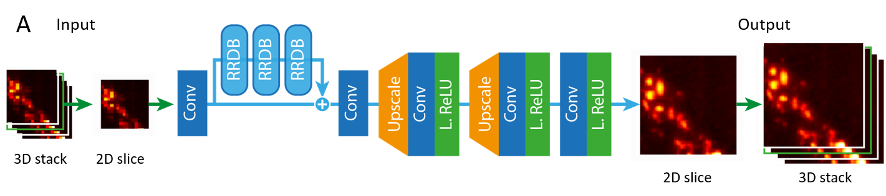
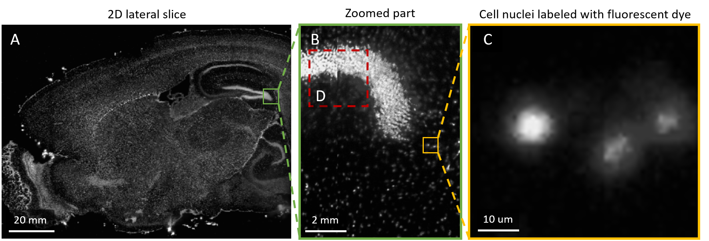
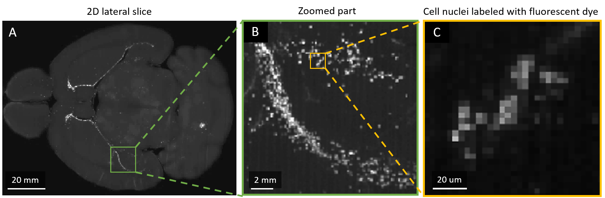
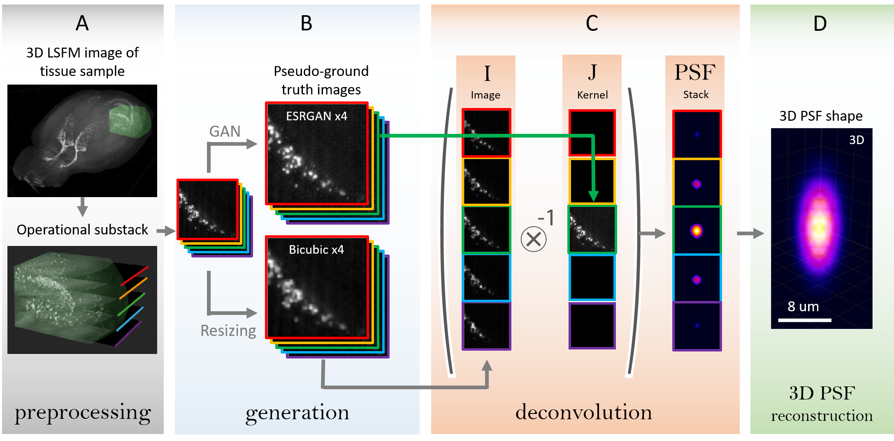
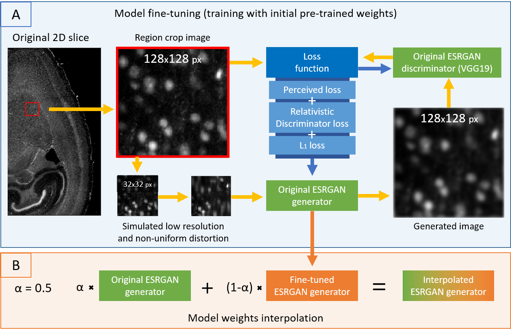
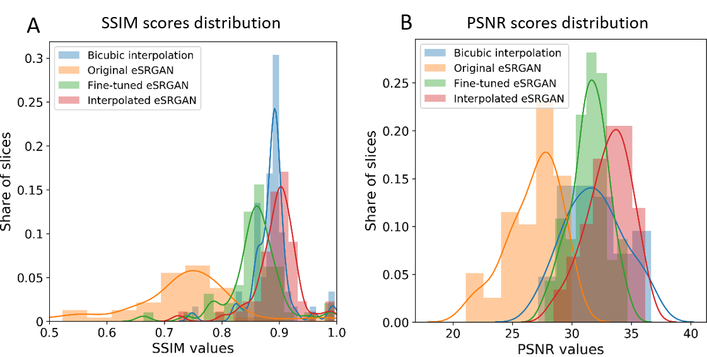
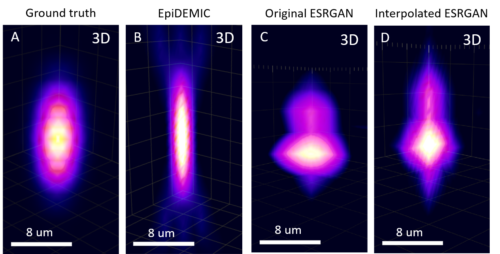
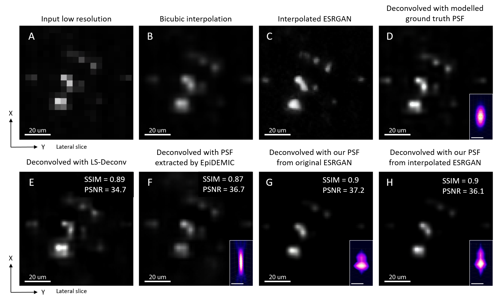
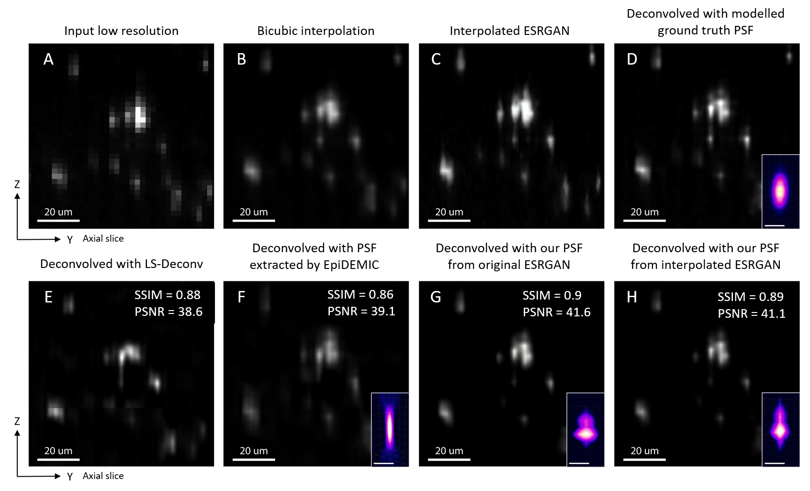

# PSF-GAN-ESTIMATION
End-to-end PSF extraction for 3D microscopy

This is a project on non-parametric estimation of 3-dimensional shape of Point Spread Function (PSF) of an optical system with the help of super-resolution simgle image generative adversarial network (SRGAN).

This project is aimed at resolution enhancement of light-sheet fluorescent microscopy images of a large tissue samples (whole organs, bodies). The *pseudo-ground truth* images are generated by GAN. These images are used as kernels in deconvolution for the point spread function (PSF) estimation. The further 3D deconvolution with these PSFs of a bicubically upsampled image allows to increase the image resolution with no fake features generation.

# Enhanced SRGAN
In the current project the Enhanced SRGAN is used from the original [mmsr github repo](https://github.com/open-mmlab/mmsr). The original article by Wang et al., discribing the architecture, training process and weight interpolation process is available on [arxiv](https://arxiv.org/abs/1809.00219).

The used GAN architecture in application to 3D stack of microscopy images:

<em>ESRGAN architecture</em>

# Requirements
## Specification of dependencies
- [PyTorch](https://pytorch.org/) (An open source deep learning platform) 

If for some reason you choose not to use Anaconda, you must install the following frameworks and packages on your system:
* Python 3.7
* Pytorch >= 1.0 (CUDA version >= 7.5 if installing with CUDA)
* [tifffile](https://pypi.org/project/tifffile/) - package to work easily read and save 16-bit .tiff files from microscopes
* opencv >= 4.1.0
* imutils - simple opencv add-on

# Data
## Datasets
The used data represents the 3D images imaged with the light-sheet fluorescent microscopy in collaboration with Brain Stem Cell Lab, MIPT & CSHL. The data is huge enough, so it is located at Computational Imaging Group local servers. There are 2 Datasets:

### Dataset 1
Available at `cig7-server/roman_kiryanov/data-Z1/`
Represents a part of mouse brain with cell nuclei labeled by propidium iodide (PI). This dataset is used for GAN fine-tuning.

<em>Dataset 1</em>

### Dataset 2
Available at `cig7-server/roman_kiryanov/data-LightSheet/`
Represents a whole mouse brain with cell nuclei labeled by 5-Ethynyl-2'-deoxyuridine (EdU). This dataset is used for GAN validation and PSF estimation.

<em>Dataset 2</em>

### Supplementary code
Both datasets are unsigned 16 bit grayscale image .tiff stack. In `microscopy_data_classes.py` the useful classes for data manipulation are present. They allow to load, visualize and crop the 3D volumes.

# Experiment
There are 3 main stages in this work. The first one is ESRGAN fine tuning, the second is a deconvolution with pseudo-generated images for PSF estimation, and the final is a 3D deconvolution of images with extracted PSFs. 

The general idea of the proposed method consist of several parts:

<em>PSF estimation stages</em>

## 1. GAN training
The code for data generation for GAN training is all combined in a one notebook `eSRGAN_data_generation_for_training.ipynb`. There the ste-by-step process of generation training data from lateral slices of original Dataset 1 is present. The code for ESRGAN fine0tuning is available in notebook `eSRGAN_manipulations_Jan2020.ipynb`. For the simplicity, the most necessary part for ESRGAN frine-tuning of [mmsr github repo](https://github.com/open-mmlab/mmsr) is copied in the folder `./mmsr_code/`.

The pipeline for GAN fine-tuning:

<em>ESRGAN optimization pipeline</em>

The results on test subset of Dataset 1 were measured with PSNR and SSIM metrics. The file `distributions_psnr_ssim_dataset_1.pkl` is a simple Python pickle object that contains these distributions:

<em>Generation comparison on test subset of Dataset 1</em>

## 2. PSF estimation
The proposed method for PSF estimation is available in notebook `eSRGAN_results_evaluation_and_hypothesis_tests.ipynb`. 
the general approach is described im Thesis, while shortly, the generated by GAN images are used as kernels in nin-blimd deconvolution (in the present work Unsupervised Wiener filter from `scipy` was used). 

The resulting data of some experiments is available in the folder `./data/` of the current repo. 

### Synthetic data experiments
* In subfolder `psf_extraction_synthetic_data_05052020` the encoded and extracted PSFs from the experiment on synthetic data are stored in a form of .tiff 3D stacks. 
* The code for all experiments is present in `Synthetic_data_manipulation.ipynb`

### Real data experiments
* In subfolder `psf_extraction_real_data_operational_substack_LS_03052020` the extracted by several methods PSFs are stored in a form of .tiff 3D stacks. 
* In notebook `PSF_analysis_29052020.ipynb` the analysis of extracted PSFs is given with collected metrics on deconvolved images. 

Extracted PSFs:

<em>Extracted PSFs</em>

## 3. Image deconvolution
This stage was done outside of Python, in ImageJ plugin [DeconvolutionLab2](http://bigwww.epfl.ch/deconvolution/deconvolutionlab2/). The Richardson-Lucy deconvolution with 10 iterations and $\lambda$ = 0.1 was used with the extracted PSFs. Also the [LS-Deconv](https://static-content.springer.com/esm/art%3A10.1038%2Fs41598-019-53875-y/MediaObjects/41598_2019_53875_MOESM4_ESM.zip) method was used from the [article by Becker et al.](https://www.researchgate.net/publication/337534916_Deconvolution_of_light_sheet_microscopy_recordings).

Results on lateral slice:

<em>Results on lateral slice</em>

Results on axial slice:

<em>Results on axial slice</em>

# Maintainer
roman.kiryanov@skoltech.ru, Roman Kiryanov
